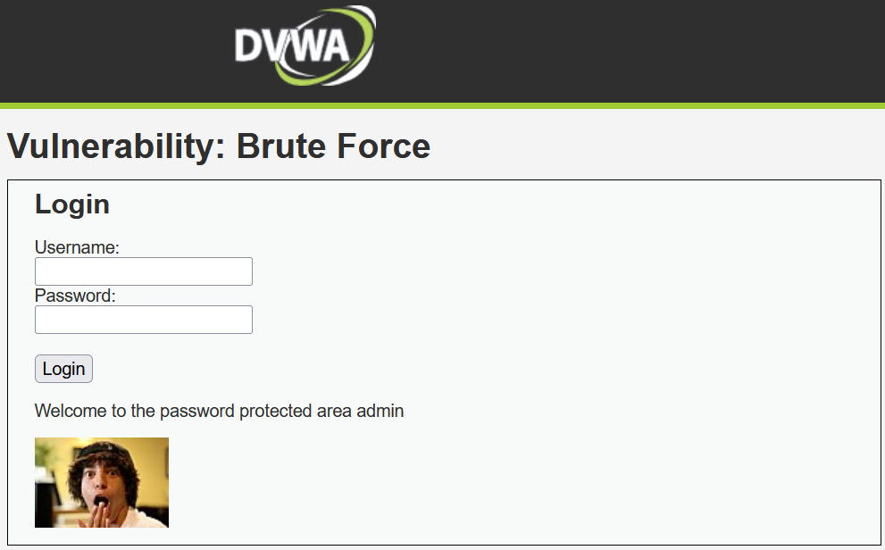
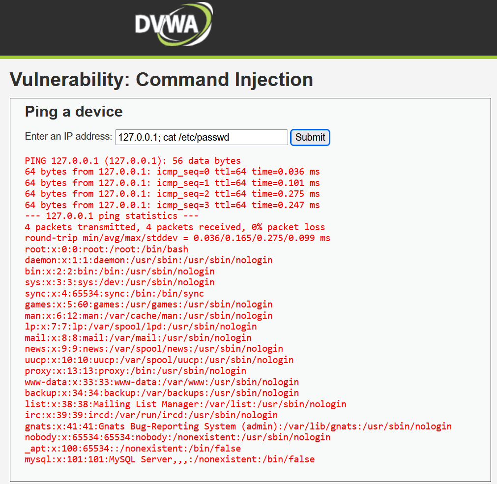

## Brute Force

### Security Level: Low

Payload:
Username: admin
Password: password

Result:
Login successful.

Explanation:
The application allows unlimited login attempts without implementing rate limiting or account lockout mechanisms. This enables attackers to guess credentials through brute force attacks.

## Command Injection

### Security Level: Low

Payload:
127.0.0.1; cat /etc/passwd

Result:
The server executed the injected command and displayed the contents of the `/etc/passwd` file after the ping command output.

Explanation:
The application constructs a system command using user input without proper sanitization. By inserting the command separator `;`, an attacker can terminate the intended command and append another command. In this case, the payload executes the `ping` command followed by `cat /etc/passwd`, which reveals the system user accounts. This demonstrates that arbitrary commands can be executed on the server, confirming the presence of a command injection vulnerability.
