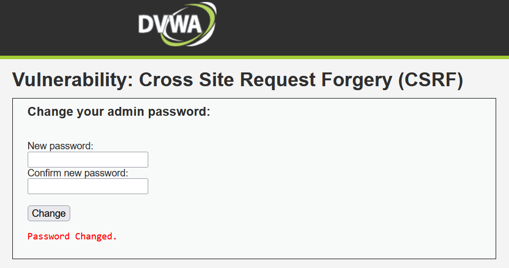

## Brute Force

### Security Level: Low

Payload:
Username: admin
Password: password

Result:
Login successful.

Explanation:
The application allows unlimited login attempts without implementing rate limiting or account lockout mechanisms. This enables attackers to guess credentials through brute force attacks.

## Command Injection

### Security Level: Low

Payload:
127.0.0.1; cat /etc/passwd

Result:
The server executed the injected command and displayed the contents of the `/etc/passwd` file after the ping command output.

Explanation:
The application constructs a system command using user input without proper sanitization. By inserting the command separator `;`, an attacker can terminate the intended command and append another command. In this case, the payload executes the `ping` command followed by `cat /etc/passwd`, which reveals the system user accounts. This demonstrates that arbitrary commands can be executed on the server, confirming the presence of a command injection vulnerability.

## Cross Site Request Forgery (CSRF)

### Security Level: Low

Payload:
http://localhost:8080/vulnerabilities/csrf/?password_new=hacked123&password_conf=hacked123&Change=Change

Result:
The password of the currently logged-in user was changed successfully without requiring the original password.

Explanation:
Cross-Site Request Forgery (CSRF) occurs when a web application accepts requests without verifying that they originate from the legitimate user interface. An attacker can trick a logged-in user into sending a malicious request to the application.

In this DVWA example, the application allows a password change through a GET request without any CSRF protection mechanism. From the PHP code, the password change is triggered when the `Change` parameter is present in the request (`if( isset( $_GET['Change'] ) )`). The application then retrieves the new password values directly from the URL using the parameters `password_new` and `password_conf`.

Because these values are taken directly from the GET request and there is no verification mechanism, the application does not check whether the request was actually initiated by the legitimate user interface. There are no CSRF tokens, origin validation checks, or referer validation implemented to ensure the authenticity of the request.

This allows an attacker to craft a malicious URL such as:
http://localhost:8080/vulnerabilities/csrf/?password_new=hacked123&password_conf=hacked123&Change=Change

If a victim is already logged into the application and clicks this link, the browser automatically sends the request along with the victim’s active session cookies. As a result, the server processes the request as if it were sent by the legitimate user and changes the password.

An attacker could also embed this request in a malicious web page using an element such as:

'<html>
<body>

</body>
</html>'

When the victim visits the attacker-controlled page, the browser automatically loads the image, which triggers the request to the DVWA server. Since the user is already authenticated, the password change request is executed without the user's knowledge or consent.
